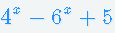

# PRiR zadania lab 5
Wzór funkcji do całkowania: <br>

Funkcja licząca wartość funkcji:
```cpp
double funct(double x)
```
Funkcje reprezentujące metody całkowania:
```cpp
double Trapez(double a, double b, int n)
```
Funkcja losująca przedziały całkowania:
```cpp
double* rollP(int X, int Y)
```
Funkcja tworząca procesy potomne liczące całki:
```cpp
void Proc(int proc_nr)
```
Funkcja licząca przybliżenie liczby PI:
```cpp
double przybpi(int n)
```
Funkcja tworząca procesy potomne liczące przybliżenia:
```cpp
void Proc(int proc_nr)
```
